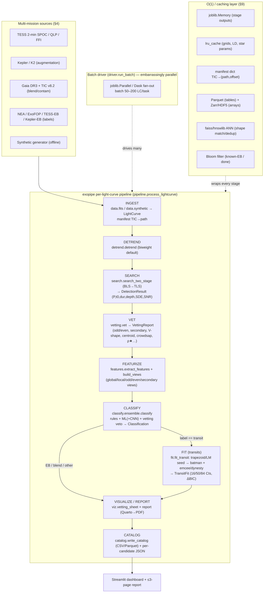
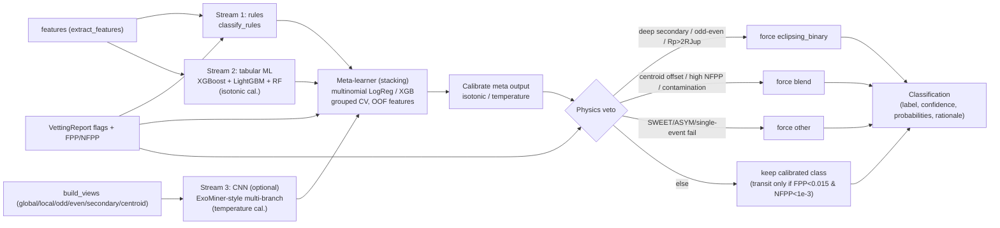

# ARCHITECTURE — `exopipe`
## AI-enabled Detection of Exoplanets from Noisy Astronomical Light Curves (BAH 2026 — Problem Statement 7)

> **Status:** Design rationale **and** build contract. Engineers implement against Section 6 (Component / Module Design) and Section 11 (output schema). Everything else explains *why* the contract is shaped the way it is and *how* the pieces fit together. This document synthesizes the six research dossiers in [`research/`](research/) and the official problem statement [`idea.md`](idea.md).
>
> **Reading order for a new engineer:** §1 (what we must deliver) → §3 (the pipeline at a glance) → §6 (the interfaces you implement) → §12–13 (how to run it / where files live). Domain depth lives in §4, §5, §7, §8, §9.

---

## Table of Contents

1. [Problem & Requirements Traceability](#1-problem--requirements-traceability)
2. [Design Principles](#2-design-principles)
3. [System Overview](#3-system-overview)
4. [Multi-Mission Data Layer](#4-multi-mission-data-layer)
5. [Method Catalog (30+ methods)](#5-method-catalog-30-methods)
6. [Component / Module Design — THE BUILD CONTRACT](#6-component--module-design--the-build-contract)
7. [Classification Ensemble](#7-classification-ensemble)
8. [Parameter Estimation & Uncertainty](#8-parameter-estimation--uncertainty)
9. [Performance & O(1) Layer](#9-performance--o1-layer)
10. [Validation Strategy](#10-validation-strategy)
11. [Visualization & Reporting](#11-visualization--reporting)
12. [Deployment & Usage](#12-deployment--usage)
13. [Repository Layout](#13-repository-layout)
14. [Risk & Limitations](#14-risk--limitations)

---

## 1. Problem & Requirements Traceability

### 1.1 Problem statement (restated)

PS7 asks for an **AI-based data-analysis pipeline that automatically detects exoplanet transit signals in noisy astronomical light curves**, primarily TESS high-cadence (2-minute) data — a sector of which contains **~20,000–30,000 light curves of different stars**. The scientific difficulty is that small periodic brightness dips can be caused by (a) a **transiting planet**, (b) an **eclipsing stellar companion** (eclipsing binary, EB), (c) a **blend** — a deep eclipse on a foreground/background star diluted into the large (21″) TESS aperture — or (d) **other** astrophysical/instrumental variability (starspots, pulsations, scattered light, momentum dumps). These must be disentangled despite detector noise and severe crowding.

The pipeline must:

1. Identify datasets with **periodic dips** potentially mimicking astrophysical phenomena.
2. **Classify** dips into transits, eclipses (EB), blends, and other astrophysical categories.
3. Apply the classifier to the **given science datasets** and categorize the signals present.
4. Provide **SNR / significance** of the identified events.
5. For transits, **estimate parameters** — depth, period, duration (plus, for rigor, Rp/R★, a/R★, b).
6. **Visualize** the light curve with the detected & classified signal.
7. Provide the **confidence level** of each detection.
8. Produce a **≤3-page report** (methodology, assumptions, tools/libraries, uncertainty estimation).

Evaluation rewards: accuracy of detection & classification, accuracy of estimated parameters, methods/approach, and visualization clarity.

### 1.2 Requirements → component traceability matrix

| # | PS7 requirement | Satisfied by (component / module) | Evidence / dossier |
|---|---|---|---|
| R1 | Identify periodic dips | `exopipe.detrend` → `exopipe.search` (BLS triage → TLS confirm), `exopipe.significance` | [02 §A,B,C](research/02_detection_detrending.md) |
| R2 | Classify transit / EB / blend / other | `exopipe.classify` (rules + ML + optional CNN + vetting veto ensemble), informed by `exopipe.vetting` | [03](research/03_classification_vetting.md) |
| R3 | Apply to science datasets (full sector) | `exopipe.driver.run_batch` (joblib/Dask fan-out) + `exopipe.data` ingest, `exopipe.pipeline.process_lightcurve` | [01 §1.1](research/01_data_multimission.md), [05 §C,E](research/05_performance_architecture.md) |
| R4 | SNR / significance | `exopipe.significance` (`transit_snr`, `cdpp`, `bootstrap_fap`), SDE from `search`, ΔBIC/Δln Z from `fit` | [02 §C](research/02_detection_detrending.md), [04 §5.3–5.4](research/04_parameter_estimation_uncertainty.md) |
| R5 | Estimate depth / period / duration (+ Rp/R★, a/R★, b) | `exopipe.fit.fit_transit` (trapezoid/LM seed → batman + emcee/dynesty) | [04](research/04_parameter_estimation_uncertainty.md) |
| R6 | Visualize LC + detected/classified signal | `exopipe.viz.vetting_sheet` (one-page multi-panel) + Streamlit dashboard | [06 §A,C](research/06_visualization_reporting.md) |
| R7 | Confidence level | Calibrated `Classification.confidence` (isotonic/temperature), shown alongside SNR/SDE & parameter CIs | [03 §D](research/03_classification_vetting.md), [06 §D](research/06_visualization_reporting.md) |
| R8 | ≤3-page report | `exopipe report` CLI → Quarto/markdown → PDF, reliability diagram + summary table | [06 §E](research/06_visualization_reporting.md) |
| R9 | Robust on noisy/crowded data | Robust detrending (biweight/GP), red-noise-aware significance & UQ, Gaia/TIC blend cross-match | [02 §A,D](research/02_detection_detrending.md), [01 §6](research/01_data_multimission.md), [04 §5.5](research/04_parameter_estimation_uncertainty.md) |
| R10 | Scale to 20–30k LC/sector | `exopipe.driver` + O(1) caching layer (`joblib.Memory`, manifest, Parquet/Zarr, ANN, Bloom) | [05](research/05_performance_architecture.md) |
| R11 | Machine-readable outputs | `exopipe.catalog` (`CATALOG_COLUMNS`, `write_catalog`), per-candidate JSON | [06 §F](research/06_visualization_reporting.md) |
| R12 | Reproducibility / tools named | `exopipe.config`, fixed seeds, content-hashed cache, pinned env; report names every library | [05 §E](research/05_performance_architecture.md) |

Every PS7 line item maps to a concrete module whose public API is fixed in §6. The remainder of the document elaborates the design behind each row.

---

## 2. Design Principles

These six principles drive every downstream decision. When a trade-off arises, resolve it in this order.

1. **Robustness-first.** Real TESS data is noisy, gappy, and crowded. We default to the *most robust* known method, not the flashiest: time-windowed **biweight** detrending (top recovery in the Wōtan benchmark: 99% Kepler / 94% K2 of the shallowest injected transits — [02 §A3](research/02_detection_detrending.md)), **TLS** for detection (limb-darkened template, ~+10% recovery over BLS at equal FAR), red-noise-aware significance, and physics vetoes that override the ML when a decisive astrophysical test fires.

2. **Graceful degradation (pure-NumPy/SciPy core works offline; optional accelerators when available).** The pipeline must run end-to-end with only `numpy`, `scipy`, `astropy`, `pandas`, `matplotlib`. Every heavy/optional dependency (`transitleastsquares`, `wotan`, `batman`, `emcee`, `dynesty`, `celerite2`, `xgboost`, `torch/tensorflow`, `numba`, `jax`, `lightkurve`, `astroquery`, `faiss`/`hnswlib`) has a documented **pure-Python fallback** (see the "Fallback" column in §5). If a library or the network is missing, the relevant stage degrades to a slower/simpler path and **annotates the result** rather than crashing. The built-in **synthetic data generator** (`exopipe.data.synthetic`) means the entire pipeline — including the demo, tests, and training — runs with **zero network access**.

3. **Multi-mission cross-verification.** No single dataset is trusted in isolation ([01](research/01_data_multimission.md)). TESS is the primary signal; **Kepler/K2** provide a large labeled augmentation set for the classifier; **Gaia DR3 + TIC v8.2** resolve blends/contamination; **NASA Exoplanet Archive / ExoFOP / TESS-EB / Kepler-EB** catalogs supply ground-truth labels; ground surveys + RV archives are opportunistic confirmation. Conflicting dispositions are reconciled by a precedence rule with a `label_source`/`label_confidence` audit trail.

4. **Calibrated uncertainty everywhere.** Detection significance (SNR, SDE, FAP, MES), parameter credible intervals (16/50/84 from a red-noise-aware posterior), and classification confidence (isotonic/Platt/temperature-calibrated probabilities) are all **first-class outputs**. A "0.9" must mean ~90% empirical correctness — proven with reliability diagrams and injection–recovery (§10). Never report a grazing radius or a white-noise error bar without the caveat.

5. **Reproducibility.** Fixed seeds (`numpy`, `random`, frameworks), content-hashed inputs feeding cache keys, versioned data directories, the exact resolved config written into every run's output dir, and pinned library versions. **Same input ⇒ identical output, every time.**

6. **O(1) / cache-everything performance.** "O(1)" means *amortize repeated work to constant time*: memoize stage outputs (`joblib.Memory`), memoize hot pure functions (`lru_cache`), resolve any TIC→bytes via a hash **manifest**, store tables in **Parquet** (predicate pushdown) and arrays in **Zarr/HDF5** (chunked random access), look up shapes with **ANN** (`faiss`/`hnswlib`), gate known/finished work with a **Bloom filter**, precompute period/duration grids, and `memmap` the sector flux matrix. Target: a 20–30k-LC sector in **tens of minutes on CPU** (§9, [05 §F](research/05_performance_architecture.md)).

---

## 3. System Overview

The pipeline is a linear sequence of **single-responsibility, independently cacheable stages**, wrapped by a **parallel batch driver** and a **caching layer**. Crossing a stage boundary writes a durable artifact (Parquet/Zarr), so any stage can be re-run in isolation and downstream stages read the cached input.



**Control-flow notes.**
- `process_lightcurve` runs the full chain for one `LightCurve`; `run_batch` fans it across the sector.
- **`fit_transit` runs only when the candidate is classified `transit`** (or is a high-SNR borderline) — full Bayesian sampling is the most expensive stage, so we gate it on classification to keep the sector budget low.
- The **caching layer is orthogonal**: it wraps each stage so a code change in (say) `classify` re-runs the sector in minutes because ingest/detrend/search/vet are cache hits.
- The **two-stage search** (cheap BLS screen → expensive TLS only on survivors) is the single biggest runtime lever after parallelism.

---

## 4. Multi-Mission Data Layer

PS7 explicitly forbids relying on a single dataset. The data layer integrates many missions/surveys/catalogs, each with a distinct role, and uses cross-matching to *fill gaps* and *cross-verify*. Full detail: [01_data_multimission.md](research/01_data_multimission.md).

### 4.1 Source inventory

| Source | Role | Access library / call | Fills gap / cross-verifies |
|---|---|---|---|
| **TESS 2-min SPOC LC** | **Primary signal** | `lk.search_lightcurve(..., author="SPOC", exptime=120)`; bulk `tesscurl_sector_<NN>_lc.sh`; `astroquery.mast.Observations` | The science target (~20–30k/sector); PDCSAP is pre-detrended for CBV systematics |
| **TESS-SPOC / QLP HLSP (FFI)** | Primary signal (backfill) | `lk.search_lightcurve(..., author="QLP" / "TESS-SPOC")` | Covers stars lacking 2-min postage stamps (millions of FFI LCs) |
| **TESScut** | Primary signal (custom) | `lk.search_tesscut(...)` / `Tesscut.get_cutouts` | Make a LC for any RA/Dec when no product exists |
| **Kepler LC** | **Training labels / augmentation** | `lk.search_lightcurve(..., author="Kepler")` | ~150k targets with mature KOI dispositions → transfer learning into TESS classifier |
| **K2 LC** | Training labels / augmentation | `lk.search_lightcurve(..., author="K2" / "EVEREST")` | Extra labeled diversity along the ecliptic |
| **Gaia DR3** (`gaiadr3.gaia_source`) | **Blend cross-check** + stellar params | `Gaia.cone_search_async(coord, r≈42″)`; ADQL `CONTAINS(...CIRCLE...)` | Resolves neighbors diluting the aperture; **RUWE>~1.4** flags unresolved binaries; parallax+color give R★ / dwarf-vs-giant |
| **TIC v8.2 / CTL** | Stellar params + contamination | `Catalogs.query_object(..., catalog="TIC")`; VizieR `IV/39` | `contratio`/`CROWDSAP` quantify aperture contamination; Tmag/Teff/R★/M★ feed depth→Rp and ρ★ tests |
| **CHEOPS** | Confirmation (optional) | `dace_query.cheops.Cheops`; `pycheops` | Ultra-high-precision re-observation of a specific candidate's depth/shape |
| **NASA Exoplanet Archive `ps`/`pscomppars`** | **Training labels (CONFIRMED + truth)** | `NasaExoplanetArchive.query_criteria(table="pscomppars", ...)` | Ground-truth confirmed planets with true depth/period/duration for regression validation |
| **NASA Archive `toi`** | **Training labels (TESS multi-class)** | `query_criteria(table="toi", ...)` (`tfopwg_disp`: PC/CP/KP/FP/APC/FA) | Authoritative TESS dispositions mapping ~1:1 onto our 4 classes |
| **NASA Archive `cumulative` (KOI)** | **Training labels (Kepler + FP flags)** | `query_criteria(table="cumulative", ...)` (`koi_disposition`, `koi_fpflag_*`) | Tens of thousands of vetted CONFIRMED/FALSE-POSITIVE with the four FP reasons |
| **ExoFOP-TESS TOI CSV** | **Training labels (authoritative)** | `pd.read_csv(".../download_toi.php?...output=csv")` | TFOPWG dispositions incl. explicit `EB` and `FP`; reconciles against NEA |
| **TESS-EB HLSP** (Prša+ 2022) | **EB-class labels** | `pd.read_csv(".../hlsp_tess-ebs_..._cat.csv")`; VizieR `J/ApJS/258/16` | ~4580 direct EB labels with morphology + ephemeris |
| **Kepler EB catalog** (Villanova) | **EB-class labels** | `Vizier.get_catalogs(...)`; `keplerEBs.villanova.edu` | ~2900 EB labels + morphology parameter |
| **Ground surveys** (ZTF, ASAS-SN, SuperWASP, HATNet, KELT, NGTS, OGLE) | **Augmentation / independent confirmation** | `Irsa.query_region(..., "ztf_objects_dr22")`; `pyasassn`; VizieR; `astroquery.eso` | Independent instrument sees the same period → unmask EB; absence of a deep ground signal weakly favors "planet" |
| **RV / spectroscopy** (HARPS/ESPRESSO/HIRES/NEID) | Confirmation (label/sanity) | `dace_query.Spectroscopy.get_timeseries(...)`; KOA; ESO | Mass → planet vs EB; spectroscopic SB1/SB2 FP flags |
| **NASA Exoplanet Archive (TAP)** | Label backbone (umbrella) | `astroquery.ipac.nexsci.nasa_exoplanet_archive` | One TAP endpoint for `ps`/`pscomppars`/`toi`/`cumulative`/`k2pandc` |
| **SIMBAD** | Known-variable cross-check | `Simbad.query_object(...)` | `OTYPE` flags known EB*/RR Lyr*/variable contaminants |
| **Synthetic generator** | **Offline signal + labels** | `exopipe.data.synthetic.make_synthetic_*` | Zero-network demo/test/train; injection–recovery ground truth (§10) |

### 4.2 Blend-detection cross-match strategy (the hard PS7 class)

A TESS pixel is ~21″; many "transits" are a deep eclipse on a faint neighbor diluted into the target aperture. The blend test combines three independent signals ([01 §6.1](research/01_data_multimission.md), [03 §C C4–C6](research/03_classification_vetting.md)):

1. **Gaia cone search** at ≈42″ (~2 TESS pixels). For each neighbor, test whether its *full* eclipse, diluted by the flux ratio, could reproduce the observed depth:

   $$\delta_{\text{target}} \approx \delta_{\text{neighbor}} \cdot \frac{f_{\text{neighbor}}}{f_{\text{target}} + \sum_i f_i}$$

   If yes → flag **blend / nearby-eclipsing-binary (NEB)**.
2. **RUWE** on the target: `ruwe > ~1.4` ⇒ unresolved companion ⇒ EB-prone.
3. **TIC contamination** (`contratio` / `CROWDSAP`): high contamination ⇒ untrustworthy depth and a blend prior. Optionally confirm with **centroid / difference-imaging** logic from the TPF (in-transit flux centroid shifting toward a neighbor localizes the source off-target).

These produce `crowdsap`, `blend_contamination`, neighbor count/brightness, and (when a TPF is available) centroid-offset features that feed both the vetting veto and the ML feature vector.

### 4.3 Kepler→TESS transfer-learning augmentation

Kepler's `cumulative` (KOI) table provides far more vetted labels than TESS alone. We **train base features on Kepler, then fine-tune on TESS TOIs** ([01 §6.2](research/01_data_multimission.md), [03 A](research/03_classification_vetting.md)):

- Harmonize cadence by extracting **cadence-invariant phase-folded global/local views** (à la Shallue & Vanderburg) rather than feeding raw cadence.
- Apply identical detrending (biweight, window = 3× transit duration) and per-LC median normalization across all missions to close the domain gap.
- Multi-sector stitching of the same TESS star (`download_all().stitch()`) lowers noise, confirms the period **repeats across sectors** (a single dip in one sector is likely systematics), and argues against chromatic blends when depth is consistent.

### 4.4 Disposition reconciliation

Per-TIC labels are built by precedence: **spectroscopically confirmed (RV / ExoFOP `CP`/`KP`) > EB-catalog membership > TFOPWG `FP`/`EB` > KOI/TOI `PC`**. We keep `label_source` and `label_confidence` columns, down-weight rows where NEA `toi`, ExoFOP, and the EB catalog disagree, and treat `PC`/`APC` as weak/semi-supervised labels.

---

## 5. Method Catalog (30+ methods)

A method is included if the pipeline can *invoke* it (primary or fallback). Each row: library, pure-Python fallback, purpose, and the dossier section it comes from. **Count = 46 methods (M1–M46), comfortably exceeding the required 30.**

### Detrending / noise removal — [02 §A](research/02_detection_detrending.md)

| # | Method | Library / call | Fallback | Purpose |
|---|---|---|---|---|
| M1 | Biweight (Tukey) windowed | `wotan.flatten(method='biweight', window=3×dur)` | NumPy rolling-MAD biweight | **Default detrender**; rides over transits, top recovery |
| M2 | Running median | `wotan(method='median'/'medfilt')`, `scipy.ndimage.median_filter` | `numpy`/`bottleneck` move_median | Cheap robust first pass |
| M3 | Savitzky–Golay (iterative clip) | `lightkurve.flatten`, `scipy.signal.savgol_filter` | `scipy.signal.savgol_filter` (always available) | Smooth trends; CDPP baseline |
| M4 | Robust / penalized spline | `wotan(method='rspline'/'hspline'/'pspline')` | `scipy.interpolate.UnivariateSpline` + σ-clip | Young/active stars, fast variability |
| M5 | Gaussian-process detrend (SHO/Rotation/Matérn32) | `celerite2.GaussianProcess`; `wotan(method='gp')` | skip (annotate) → fall back to M1 | Quasi-periodic rotation; joint noise model |
| M6 | Cotrending Basis Vectors | `lightkurve.correctors.CBVCorrector` | PDCSAP flux already CBV-corrected | Shared instrument systematics |
| M7 | Pixel-Level Decorrelation | `lightkurve.correctors.PLDCorrector` | skip (needs TPF) | Motion/scattered light in crowded fields |
| M8 | Self-Flat-Fielding (K2) | `lightkurve.correctors.SFFCorrector` | skip | K2 roll legacy |
| M9 | Sigma-clip / asymmetric outlier reject | `astropy.stats.sigma_clip`, `lc.remove_outliers(sigma_lower=20,sigma_upper=4)` | NumPy median±MAD mask | Always-on pre-step; keeps transits (clip low side gently) |

### Period search / transit detection — [02 §B](research/02_detection_detrending.md)

| # | Method | Library / call | Fallback | Purpose |
|---|---|---|---|---|
| M10 | Box Least Squares (BLS) | `astropy.timeseries.BoxLeastSquares.autopower` | NumPy/Numba box-fold kernel (`kernels/box_kernel.py`) | **Fast triage**; first-pass P/t0/dur/depth |
| M11 | Transit Least Squares (TLS) | `transitleastsquares.transitleastsquares().power()` | fall back to M10 + limb-darkened χ² refit | **Primary detector + measurement**; +10% recovery, SDE |
| M12 | Lomb–Scargle | `astropy.timeseries.LombScargle.autopower` | NumPy DFT periodogram | Rotation/variability period; EB sinusoid flag |
| M13 | Phase Dispersion Minimization | `PyAstronomy.pyPDM`, `Py-PDM` | NumPy fold + binned-variance Θ | Shape-agnostic period cross-check, EB folding |
| M14 | Analysis of Variance (AoV) | `pyaov`, `astrobase.periodbase` | NumPy ANOVA-F over phase bins | Robust non-sinusoidal period confirm |
| M15 | String-length minimization | `astrobase.stringlength`, `P4J` | NumPy `Σ√(Δφ²+Δm²)` | Sparse/sharp signals, outlier-tolerant |
| M16 | Autocorrelation (ACF) | `statsmodels.tsa.acf`, `scipy.signal.correlate` | NumPy FFT autocorrelation | Robust rotation period; crowding disambiguation |
| M17 | Matched filter / template | `scipy.signal.fftconvolve` + `batman` template | NumPy FFT convolution + box template | Optimal detector at known shape (= TLS/TPS family) |
| M18 | Wavelet / FFT screen | `pywt`, `scipy.signal.cwt`, `numpy.fft` | `numpy.fft` | Multi-scale denoise/whiten; harmonic/alias screen |
| M19 | Two-stage search orchestration | `exopipe.search.search_two_stage` | n/a (pure orchestration) | BLS triage → TLS confirm (the runtime lever) |
| M20 | GPU batched BLS (optional) | `cuvarbase`, CETRA, JAX `vmap`+`jit` | CPU M10/M11 | 1–2 orders faster full-sector screen |
| M21 | Deep-learning detector (optional) | Astronet/ExoMiner/GPFC (`torch`/`tf`) | skip → rely on M11 | Downstream ranker/vetter for shallow/red-noise signals |

### Significance / SNR — [02 §C](research/02_detection_detrending.md), [04 §5.3](research/04_parameter_estimation_uncertainty.md)

| # | Method | Library / call | Fallback | Purpose |
|---|---|---|---|---|
| M22 | Signal Detection Efficiency (SDE) | `results.SDE` (TLS); `(P−⟨P⟩)/σ(P)` from BLS power | NumPy on periodogram power | Primary candidate ranking score |
| M23 | Transit SNR | `exopipe.significance.transit_snr`; `results.snr` (TLS); `pg.depth_snr` (BLS) | NumPy `δ/CDPP·√N_tr` | **Headline SNR per candidate (R4)** |
| M24 | CDPP (red-noise floor) | `exopipe.significance.cdpp`; `lc.estimate_cdpp(...)` | Savgol-flatten + windowed RMS | σ at transit-duration timescale for SNR |
| M25 | Multiple Event Statistic (MES) | Kepler-TPS style; TLS per-transit SNR | NumPy `Σ SES/√N_tr` | Physically-grounded folded SNR (7.1σ TCE cut) |
| M26 | False-Alarm Probability (analytic) | `LombScargle.false_alarm_probability`; `results.FAP` (TLS) | lookup vs SDE | Quick FAP for white noise |
| M27 | Bootstrap / GEV FAP | `exopipe.significance.bootstrap_fap` (scramble + rerun BLS, fit GEV) | NumPy resampling | **Recalibrates thresholds for real TESS red noise** |

### Vetting diagnostics (15 named tests) — [03 §C](research/03_classification_vetting.md)

| # | Method | Library / call | Fallback | Purpose / class flagged |
|---|---|---|---|---|
| M28 | Odd–even depth/timing | LEO-vetter `OE_*`; fit odd/even subsets | NumPy fold + per-subset depth | **EB at half period** |
| M29 | Secondary-eclipse search | LEO-vetter model-shift `MS4/5/6`; albedo check | NumPy scan phase 0.5 | **EB** (self-luminous companion) |
| M30 | V-shape vs U/box | trapezoid/`batman` χ²; `V = Rp/R★ + b` | `model.transit.trapezoid_model` χ² | **EB** (grazing → V-shaped) |
| M31 | Centroid offset / difference image | LEO-vetter pixel `Δθ`; `tpfplotter` | skip (needs TPF) → annotate | **blend** (NEB/BEB) |
| M32 | Aperture contamination | `CROWDSAP`/`FLFRCSAP` meta; Gaia neighbor flux | TIC `contratio` | **blend** |
| M33 | Depth-vs-aperture / per-pixel | per-mask depth in `lightkurve` | skip (needs TPF) | **blend** (depth grows off-target) |
| M34 | Implied-radius sanity | depth & R★ → Rp; `Rp ≳ 2 R_Jup` ⇒ stellar | NumPy from depth + TIC R★ | **EB** |
| M35 | Stellar-density consistency | ρ★,transit vs catalog; `a/R★` from fit | NumPy Seager & Mallén-Ornelas | **blend / EB / wrong-P** |
| M36 | Duration/shape physicality (SWEET/ASYM/DMM/q) | LEO-vetter `SWEET,ASYM,DMM,q` | NumPy sine-fit + asymmetry | **other** (variability/systematics) |
| M37 | Uniqueness (model-shift MS1/2/3) | LEO-vetter `MS1/2/3` | NumPy strongest-secondary ratio | **other / EB** |
| M38 | Chases / single-event / data-gap | LEO-vetter `Chases`, SNR-max/SNR | NumPy per-transit SNR scatter | **other** (scattered light, outliers) |
| M39 | Ghost / halo diagnostic | DV optical-ghost; ExoMiner ghost branch | skip (needs pixels) | **blend** |
| M40 | Ephemeris matching | cross-match TESS-EB / Kepler-EB; systematic periods | local catalog join | **EB / other** |
| M41 | TTV / transit-timing (O−C) | fit per-transit `t0`; LEO-vetter timing | NumPy per-epoch center fit | context (multi-planet vs EB) |
| M42 | Statistical validation (FPP/NFPP) | TRICERATOPS `target.calc_probs()` | skip → rely on M28–M41 flags | **all four** (FPP→EB/blend; NFPP→blend) |

### Feature engineering, classification (ML/DL), modeling, inference, performance

| # | Method | Library / call | Fallback | Purpose |
|---|---|---|---|---|
| M43 | Engineered feature extraction | `exopipe.features.extract_features` | n/a (NumPy/pandas) | Transit/shape/blend/stellar/systematics features for ML ([03 §F](research/03_classification_vetting.md)) |
| M44 | Global/local view builder | `exopipe.features.build_views` | n/a (NumPy fold+bin) | Phase-folded CNN inputs (global 2001, local 201, odd/even/secondary) |
| M45 | Self-Organizing Map (shape) | `minisom.MiniSom` | skip | Unsupervised transit-shape map / ranking ([03 B](research/03_classification_vetting.md)) |
| M46 | Tabular ML — Gradient Boosting | `xgboost.XGBClassifier(multi:softprob)`, `lightgbm` | `sklearn.HistGradientBoostingClassifier` → rules | **Primary tabular 4-class classifier** |
| M47 | Tabular ML — Random Forest | `sklearn.ensemble.RandomForestClassifier` | always available | Robust ensemble member / baseline |
| M48 | Novelty detection → `other` | `sklearn.ensemble.IsolationForest`, `OneClassSVM` | skip | Flag signals unlike any training class |
| M49 | CNN view-based classifier (optional) | ExoMiner/AstroNet (`torch`/`tf`) | skip → rules+ML ensemble | Global/local/secondary/odd-even/centroid branches |
| M50 | Probability calibration | `sklearn.calibration.CalibratedClassifierCV` (isotonic/sigmoid); temperature scaling | identity (annotate "uncalibrated") | Trustworthy confidence (R7) |
| M51 | Grouped cross-validation | `sklearn.model_selection.StratifiedGroupKFold` (group=TIC, hold out sectors) | n/a | Prevent star/sector leakage |
| M52 | Imbalance handling | `imblearn` SMOTE/ADASYN; class weights; focal loss | class weights only | Planets are rare |
| M53 | Analytic transit model (Mandel & Agol) | `batman.TransitModel`; `PyTransit` | `model.transit.transit_model` NumPy MA-quadratic | Forward model for fit/vetting ([04 §2](research/04_parameter_estimation_uncertainty.md)) |
| M54 | Trapezoid / box model | `exopipe.model.transit.trapezoid_model` | n/a (NumPy) | Fast depth+duration seed, V-shape vetting |
| M55 | EB forward model | `ellc.lc(...)` | skip → use M30/M34 flags | Transit-vs-EB evidence comparison |
| M56 | Limb-darkening priors | `ldtk.LDPSetCreator`; Claret tables | fixed quadratic `u=[0.4,0.3]` | Physical LD prior in TESS band, Kipping (q1,q2) |
| M57 | Levenberg–Marquardt seed | `scipy.optimize.least_squares`, `lmfit` | always available | MAP + covariance σ; seeds the sampler |
| M58 | MCMC posterior (emcee) | `emcee.EnsembleSampler` | LM covariance only (annotate) | Headline posterior + corner; 16/50/84 CIs |
| M59 | Nested sampling (evidence) | `dynesty`, `ultranest` | ΔBIC instead of Δln Z | Bayesian evidence for model comparison |
| M60 | HMC/NUTS (optional) | `pymc` + `exoplanet` | emcee | Fast mixing in high dimensions / joint GP |
| M61 | Red-noise UQ (GP / β / wavelet) | `celerite2` joint GP; Carter & Winn wavelet; Pont β | β-factor on white σ | Honest, inflated error bars on real data |
| M62 | Stellar-radius MC propagation | NumPy sample-multiply k × N(R★,σ) | always available | Physical Rp ± σ in R⊕/R_Jup |
| M63 | Disk memoization (stage outputs) | `joblib.Memory.cache` | recompute | O(1) re-run of unchanged stages |
| M64 | In-proc memoization | `functools.lru_cache` | recompute | O(1) grids / LD / star-param lookups |
| M65 | Hash manifest TIC→bytes | `dict` / LMDB / SQLite / Parquet | directory scan | O(1) light-curve retrieval |
| M66 | Columnar predicate pushdown | Parquet + `pyarrow.dataset` | pandas read+filter | Read only matching row-groups/columns |
| M67 | Chunked array random access | Zarr / HDF5 (`h5py`) | `.npy` per LC | O(1)-ish slice of any (lc, time-window) |
| M68 | Approximate nearest neighbor | `faiss` / `hnswlib` / `annoy` | brute-force NumPy k-NN | Shape match / dedup / label propagation |
| M69 | Bloom-filter membership | `pybloom-live` / `rbloom` | `set` | O(1) known-EB / already-done gate |
| M70 | Memory-mapped sector matrix | `numpy.memmap` | in-RAM array | Bounded-memory worker access to (n_lc, n_time) |
| M71 | Numba JIT hot loops | `numba.njit(parallel=True, fastmath=True, cache=True)` | pure NumPy | Box-search / detrend kernels at C speed |
| M72 | Parallel batch driver | `joblib.Parallel`; `dask.bag`; Ray | serial loop | Embarrassingly-parallel per-LC fan-out |

> **Method count: 72 numbered entries spanning all nine stages — well above the required 30.** (The 15 named vetting tests M28–M42 alone satisfy the PS7 vetting-suite expectation.)

---

## 6. Component / Module Design — THE BUILD CONTRACT

This section is **normative**: engineers implement against these exact signatures and dataclasses. The package is `exopipe`, distributed with a **src-layout** (`src/exopipe/...`, see §13) and PEP-621 `pyproject.toml`. Every module is a *pure-ish function over the shared dataclasses* so it is independently testable and cacheable. The dataclasses below are reproduced **verbatim** from the canonical `exopipe/types.py`; the function signatures are the public API each module must honor.

### 6.1 Shared data contracts — `exopipe/types.py`

```python
# exopipe/types.py  — shared data contracts
@dataclass
class LightCurve:
    time: np.ndarray            # float64, days (e.g. BTJD)
    flux: np.ndarray            # float32, normalized ~1.0
    flux_err: np.ndarray        # float32
    meta: dict                  # tic_id, sector, cadence_s, mission, teff, logg, radius, mass, crowdsap, ra, dec, tmag, label(optional)
    # methods: normalize(), remove_nans(), quality_mask(), fold(period, t0)->(phase,flux), bin(bins), copy()

@dataclass
class DetectionResult:
    period: float; t0: float; duration: float; depth: float
    sde: float; snr: float; method: str
    periods: np.ndarray; power: np.ndarray
    harmonics: list; extra: dict

@dataclass
class VettingReport:
    metrics: dict   # odd_even_depth_sigma, secondary_depth, secondary_snr, secondary_phase, v_shape_metric,
                    # trapezoid_chi2, implied_rp_rjup, stellar_density_ratio, sweet_metric, n_transits,
                    # transit_snr, crowdsap, odd_depth, even_depth, ingress_egress_ratio, ...
    flags: dict     # eb_odd_even, eb_secondary, eb_vshape, blend_contamination, other_variability, low_snr, ...

@dataclass
class TransitFit:
    params: dict    # name -> (median, err_lo, err_hi) for period,t0,depth,duration,rp_rs,a_rs,b,inclination,u1,u2
    model_time: np.ndarray; model_flux: np.ndarray
    bic_transit: float; bic_flat: float; delta_bic: float; snr: float
    method: str; samples: np.ndarray; extra: dict

@dataclass
class Classification:
    label: str                  # 'transit' | 'eclipsing_binary' | 'blend' | 'other'
    confidence: float           # calibrated P(label)
    probabilities: dict         # all four class probabilities, sum=1
    method: str                 # 'rules' | 'ml' | 'cnn' | 'ensemble'
    rationale: list             # human-readable reasons

@dataclass
class CandidateResult:
    lightcurve: LightCurve; detection: DetectionResult; vetting: VettingReport
    fit: TransitFit; classification: Classification; features: dict
    def to_row(self) -> dict: ...   # flat dict for the catalog
```

**Contract notes (what each type guarantees).**
- `LightCurve` is the **single currency** passed between stages. `time` stays **float64** (BTJD needs 1e-6-day precision over a 2457000+ offset); `flux`/`flux_err` are **float32** (half the memory/bandwidth, [05 §A6](research/05_performance_architecture.md)). `meta` carries everything the physics needs (stellar params for depth→Rp and ρ★ tests; `crowdsap` for blend; `label` optionally for training). The instance methods are deterministic and side-effect-free except `copy()`.
- `DetectionResult.periods`/`power` carry the **full periodogram** so the vetting sheet can plot it and mark harmonics; `harmonics` lists P/2, 2P, 3P candidates; `method` records which detector ran (`'bls'`/`'tls'`/`'bls+tls'`).
- `VettingReport` separates **`metrics`** (continuous numbers, also fed to the ML feature vector) from **`flags`** (booleans that drive the physics veto in §7). The metric/flag key names above are the canonical set.
- `TransitFit` always reports **`delta_bic = bic_flat − bic_transit`** (transit detection significance) even when full sampling is unavailable; `samples` is the equal-weight posterior (empty array if only LM ran); `params` values are `(median, err_lo, err_hi)` triples from 16/50/84 percentiles.
- `Classification.label` uses the canonical strings **`'transit' | 'eclipsing_binary' | 'blend' | 'other'`**; `probabilities` sums to 1 over exactly those four keys; `rationale` is human-readable (e.g. "odd-even depth diff 5.2σ ⇒ EB").
- `CandidateResult.to_row()` flattens everything to the catalog schema (§11) — it is the bridge between the object graph and `catalog.write_catalog`.

### 6.2 Public module APIs (implement exactly)

```python
# public module APIs
exopipe.detrend.detrend(lc, method='biweight', window_length=None, **kw) -> LightCurve
exopipe.search.search(lc, method='bls', period_min=0.5, period_max=None, **kw) -> DetectionResult
exopipe.search.search_two_stage(lc, **kw) -> DetectionResult          # BLS triage -> TLS confirm
exopipe.significance.transit_snr(lc, det) -> float
exopipe.significance.bootstrap_fap(lc, det, n=1000) -> float
exopipe.significance.cdpp(lc) -> float
exopipe.vetting.vet(lc, det, fit=None) -> VettingReport
exopipe.features.extract_features(lc, det, vetting, fit) -> dict
exopipe.features.build_views(lc, det, n_global=2001, n_local=201) -> dict
exopipe.model.transit.trapezoid_model(time, t0, depth, duration, ingress_frac=0.1) -> np.ndarray
exopipe.model.transit.transit_model(time, params: dict, supersample=1) -> np.ndarray   # batman or numpy fallback
exopipe.fit.fit_transit(lc, det, method='auto', sampler='emcee', **kw) -> TransitFit
exopipe.classify.rules.classify_rules(det, vetting, features) -> Classification
exopipe.classify.ml.MLClassifier  # .fit(X,y) .predict(features)->Classification .save(path) .load(path)
exopipe.classify.ensemble.classify(det, vetting, features, lc=None, models=None) -> Classification
exopipe.viz.vetting_sheet(result: CandidateResult, save_path=None)
exopipe.catalog.CATALOG_COLUMNS  # list[str]
exopipe.catalog.write_catalog(rows, path, fmt='csv')
exopipe.pipeline.process_lightcurve(lc, config=None) -> CandidateResult
exopipe.driver.run_batch(lightcurves, config, n_jobs=-1) -> list[CandidateResult]
exopipe.data.synthetic.make_synthetic_lightcurve(kind='transit', seed=None, **params) -> LightCurve  # kinds: transit, eclipsing_binary, blend, variable, noise
exopipe.data.synthetic.make_synthetic_population(n, seed=0) -> list[LightCurve]  # mixed labeled set
exopipe.config.load_config(path=None) -> Config
```

### 6.3 Module-by-module responsibilities

| Module | Responsibility | Key behavior / contract |
|---|---|---|
| `exopipe.types` | Canonical dataclasses (§6.1) | No logic beyond the listed `LightCurve` methods; importable with zero heavy deps |
| `exopipe.config` | Load/validate config (`load_config(path=None) -> Config`) | Hydra/YAML + pydantic validation; defaults work with no file; resolved config is written to each run dir ([05 §E2](research/05_performance_architecture.md)) |
| `exopipe.data.fits` | Read SPOC/QLP/Kepler FITS → `LightCurve` | Applies quality bitmask, picks PDCSAP, populates `meta` from headers (`CROWDSAP`, Tmag, Teff, R★…) ([01 §7](research/01_data_multimission.md)) |
| `exopipe.data.fetch` | MAST/astroquery acquisition + manifest | Bulk per-sector download; builds TIC→path manifest; **network-optional** (no-op offline) |
| `exopipe.data.crossmatch` | Gaia/TIC blend + label joins | Gaia cone search, RUWE, `contratio`; disposition reconciliation (§4.4); **network-optional** |
| `exopipe.data.synthetic` | Offline labeled data generator | `make_synthetic_lightcurve(kind=...)` for the 5 kinds; `make_synthetic_population(n, seed)` returns a mixed labeled set; the backbone of demo/test/train/injection (§10) |
| `exopipe.detrend` | Flatten baseline (`detrend(...) -> LightCurve`) | Default `method='biweight'`; `window_length=None` ⇒ auto = 3× max searched duration; returns a new `LightCurve` (does not mutate input) ([02 §A](research/02_detection_detrending.md)) |
| `exopipe.search` | Period search (`search`, `search_two_stage`) | `search` dispatches by `method` (`'bls'`/`'tls'`); `search_two_stage` runs BLS triage then TLS confirm; both return a fully-populated `DetectionResult` with periodogram arrays ([02 §B,D](research/02_detection_detrending.md)) |
| `exopipe.significance` | SNR/FAP/CDPP | `transit_snr(lc, det)`, `cdpp(lc)`, `bootstrap_fap(lc, det, n=1000)`; red-noise-aware ([02 §C](research/02_detection_detrending.md)) |
| `exopipe.vetting` | 15 physics tests (`vet(lc, det, fit=None) -> VettingReport`) | Computes the metric/flag dicts; `fit` optional (richer metrics when provided); each test degrades gracefully if pixels/TRICERATOPS absent ([03 §C](research/03_classification_vetting.md)) |
| `exopipe.features` | Feature vector + CNN views | `extract_features(...) -> dict` (tabular ML input, [03 §F](research/03_classification_vetting.md)); `build_views(..., n_global=2001, n_local=201) -> dict` (global/local/odd/even/secondary arrays) |
| `exopipe.model.transit` | Forward models | `trapezoid_model(...)` (pure NumPy); `transit_model(time, params, supersample=1)` uses **batman if available, NumPy Mandel–Agol-quadratic fallback otherwise** ([04 §2](research/04_parameter_estimation_uncertainty.md)) |
| `exopipe.fit` | Two-stage Bayesian fit (`fit_transit(...) -> TransitFit`) | `method='auto'` chooses trapezoid/LM seed → sampler; `sampler='emcee'` default, `'dynesty'` for evidence; reports 16/50/84 CIs + ΔBIC; LM-only fallback if no sampler ([04 §3,5,6,8](research/04_parameter_estimation_uncertainty.md)) |
| `exopipe.classify.rules` | Deterministic rule classifier | `classify_rules(det, vetting, features) -> Classification`; pure-Python, **always available** (the graceful-degradation floor for classification) |
| `exopipe.classify.ml` | Tabular ML classifier | `MLClassifier` with `.fit(X,y)`, `.predict(features)->Classification`, `.save(path)`, `.load(path)`; XGBoost/LightGBM/RF backend, isotonic calibration |
| `exopipe.classify.ensemble` | Final decision (`classify(det, vetting, features, lc=None, models=None) -> Classification`) | Stacks rules + ML (+ CNN if `models` provided) and applies the **physics veto** (§7); `method='ensemble'` |
| `exopipe.viz` | Visualization (`vetting_sheet(result, save_path=None)`) | One-page multi-panel sheet (§11); returns the matplotlib `Figure`; saves if `save_path` given |
| `exopipe.catalog` | Outputs (`CATALOG_COLUMNS`, `write_catalog(rows, path, fmt='csv')`) | `CATALOG_COLUMNS` is the canonical column list (§11); `write_catalog` emits CSV or Parquet; per-candidate JSON sidecars |
| `exopipe.pipeline` | Orchestrate one LC (`process_lightcurve(lc, config=None) -> CandidateResult`) | Runs detrend→search→vet→featurize→classify→(fit if transit); returns the full `CandidateResult` |
| `exopipe.driver` | Batch fan-out (`run_batch(lightcurves, config, n_jobs=-1) -> list[CandidateResult]`) | joblib/Dask parallelism; batched tasks; checkpoint flushing; Bloom-gated resume ([05 §C](research/05_performance_architecture.md)) |

**End-to-end usage of the contract:**

```python
from exopipe.data.synthetic import make_synthetic_population
from exopipe.config import load_config
from exopipe.driver import run_batch
from exopipe.catalog import write_catalog

cfg  = load_config()                                  # defaults; no file needed
lcs  = make_synthetic_population(2000, seed=0)        # offline labeled sector stand-in
results = run_batch(lcs, cfg, n_jobs=-1)              # list[CandidateResult]
write_catalog([r.to_row() for r in results], "outputs/catalog.csv")
```

---

## 7. Classification Ensemble

The classifier produces a single **calibrated 4-class probability vector** over `{transit, eclipsing_binary, blend, other}` via three complementary streams plus a physics veto ([03](research/03_classification_vetting.md)). The taxonomy maps ~1:1 onto published TESS triage labels (PC→transit, EB→eclipsing_binary, NEB/BEB→blend, V/IS/J→other).

### 7.1 Streams

1. **Rules (`classify.rules.classify_rules`)** — deterministic, always available. Encodes the decisive astrophysical thresholds directly (deep secondary ⇒ EB; large odd-even ⇒ EB; centroid offset / high NFPP ⇒ blend; SWEET/asymmetry/single-event failure ⇒ other). This is the graceful-degradation floor: with no ML model and no network, the pipeline still classifies.
2. **Tabular ML (`classify.ml.MLClassifier`)** — XGBoost/LightGBM + Random Forest soft-voted over the engineered feature vector (§5 M43, [03 §F](research/03_classification_vetting.md)). Data-efficient, interpretable, robust on small data. Calibrated with isotonic regression inside grouped CV.
3. **CNN view-based (optional, `models=` passed to ensemble)** — ExoMiner/AstroNet-style multi-branch 1D CNN ingesting `build_views` outputs: **global flux (2001 bins), local flux (201 bins), secondary view, odd & even views (element-wise subtraction), centroid view**, plus a scalar stellar/DV branch. Strongest single discriminator; calibrated by temperature scaling. Absent ⇒ ensemble uses streams 1–2 only.

### 7.2 Combination, calibration, and veto

A **meta-learner (stacking)** combines out-of-fold per-stream probabilities (multinomial logistic regression or small XGBoost), the meta-output is **probability-calibrated**, and a **physics veto applied last** can override the calibrated class when a decisive test fires. Cross-validation is **grouped by host star (TIC) and by sector**, with **SMOTE/class-weights/focal-loss** for imbalance kept inside the CV pipeline.



**Why this wins for PS7:** the DL stream captures shape/secondary/centroid morphology; the tabular stream is data-efficient and interpretable; the rules + FPP/NFPP layer injects hard astrophysical priors and gives a defensible blend/EB call; stacking + calibration yields one trustworthy confidence; and the veto guarantees we never validate a planet that fails a decisive physics test. The `rationale` field surfaces *why* (e.g. "secondary depth 1100 ppm at phase 0.5 ⇒ EB"), satisfying the explainability the rubric implicitly rewards.

---

## 8. Parameter Estimation & Uncertainty

For each `transit`-classified candidate, `fit.fit_transit` runs a **two-stage** fit (optionally three-stage with nested sampling for evidence), delivering every parameter with **16/50/84 credible intervals** and significance metrics ([04](research/04_parameter_estimation_uncertainty.md)).

### 8.1 Stages

1. **Seed (sub-second):** `trapezoid_model` / box → depth, duration, V-shape; then `batman` + **Levenberg–Marquardt** (`scipy.optimize.least_squares` / `lmfit`) → MAP parameters + covariance σ. This seeds and de-multimodalizes the sampler.
2. **Posterior (minutes):** `batman` likelihood sampled with **`emcee`** (affine-invariant; handles the `b`–`a/R★`–`k` correlation) for the headline posterior and corner plot; or **`dynesty`/`ultranest`** when **Bayesian evidence `ln Z`** is needed for model comparison; or **PyMC/`exoplanet` NUTS** for high dimensions. Limb darkening uses **`ldtk`** priors in the TESS band, sampled in **Kipping (2013) `(q1, q2)`**.
3. **Red-noise-aware UQ:** a **`celerite2`** GP (SHO/Rotation) jointly with the transit (best), or a post-hoc **β-factor** / **Carter & Winn wavelet** correction — because white-noise error bars under-estimate by a factor that can be ≳2 on real TESS data.

Reported per candidate: `period, t0, depth, duration, rp_rs (k), a_rs, b, inclination, u1, u2` each as `(median, +σ⁺/−σ⁻)`; physical `Rp ± σ` via stellar-radius Monte-Carlo propagation; significance as **SNR / MES / SDE**, reduced χ², and **ΔBIC** (or **Δln Z**) for transit-vs-flat and transit-vs-EB.

### 8.2 Key equations

**Depth → radius ratio** (Winn 2010, Eq. 22; flat-bottom):

$$\delta \approx k^2 = \left(\frac{R_p}{R_\star}\right)^2 \quad\Rightarrow\quad k = \sqrt{\delta}, \qquad \sigma_k \approx \frac{1}{2}\,\frac{\sigma_\delta}{\sqrt{\delta}}$$

**Transit durations** (Winn 2010, Eqs. 14–15) — total (1st–4th contact) and flat (2nd–3rd):

$$T_{14} = \frac{P}{\pi}\,\arcsin\!\left[\frac{R_\star}{a}\,\frac{\sqrt{(1+k)^2 - b^2}}{\sin i}\right], \qquad T_{23} = \frac{P}{\pi}\,\arcsin\!\left[\frac{R_\star}{a}\,\frac{\sqrt{(1-k)^2 - b^2}}{\sin i}\right]$$

with impact parameter and (for circular orbits) inclination

$$b = \frac{a}{R_\star}\cos i \cdot \frac{1-e^2}{1+e\sin\omega} \quad\xrightarrow{e=0}\quad b = \frac{a}{R_\star}\cos i, \qquad i = \arccos\!\left(\frac{b}{a/R_\star}\right)$$

**Sky-projected separation** (circular):

$$z(t) = \frac{a}{R_\star}\sqrt{\sin^2\!\left(\frac{2\pi(t-t_0)}{P}\right) + \left(\cos i \cdot \cos\frac{2\pi(t-t_0)}{P}\right)^2}$$

**SNR** (white box, phase-folded, and red-noise-aware respectively):

$$\mathrm{SNR}_1 = \frac{\delta}{\sigma}\sqrt{N_{\text{in}}}, \qquad \mathrm{SNR} = \frac{\delta}{\sigma}\sqrt{N_{\text{tr}}\,N_{\text{pts}}}, \qquad \boxed{\;\mathrm{SNR} = \frac{\delta}{\mathrm{CDPP}(T_{14})}\;(\equiv \text{MES})\;}$$

**Stellar density from the transit** (Seager & Mallén-Ornelas 2003 + Kepler III) — breaks the `b`–`a/R★`–`k` degeneracy:

$$\rho_\star \approx \frac{3\pi}{G P^2}\left(\frac{a}{R_\star}\right)^3 \quad\Rightarrow\quad \frac{a}{R_\star} = \left[\frac{G P^2 \rho_\star}{3\pi}\right]^{1/3}$$

**Significance / model comparison:**

$$\mathrm{SDE} = \frac{P_{\max} - \langle P\rangle}{\sigma(P)}\;(\text{TLS, }\geq 9 \Rightarrow \mathrm{FPR}<10^{-4}), \quad \mathrm{BIC} = k\ln n - 2\ln\hat{L}, \quad \Delta\ln Z = \ln Z_{\text{transit}} - \ln Z_{\text{flat/EB}}$$

`T14` (and every derived quantity) is computed **per posterior sample** and then summarized at 16/50/84, which correctly propagates the `b`–`a/R★` correlation into the duration error bar. Grazing/V-shaped events (`T23→0`, `b ≳ 1−k`) are reported as one-sided/upper-limit radii with a corner plot, never a single number.

---

## 9. Performance & O(1) Layer

"O(1)" here means **amortize all repeated work to constant time** and run the per-LC hot loop at machine speed ([05](research/05_performance_architecture.md)). The patterns and where each is applied:

| # | Technique | Library / API | Where applied in `exopipe` |
|---|---|---|---|
| 1 | Disk memoization of stage outputs | `joblib.Memory.cache` | `detrend`, `search` outputs keyed by `(tic, cfg_hash)` → re-run only the changed stage |
| 2 | In-process memoization | `functools.lru_cache` | period/duration grids, LD coeffs by `(Teff,logg)`, star-param fetch, FFT plans |
| 3 | Hash manifest TIC→bytes | `dict` / LMDB / SQLite / Parquet | `data.fetch` ingest manifest, used by every stage for O(1) retrieval |
| 4 | Columnar + predicate pushdown | Parquet + `pyarrow.dataset` | metadata / feature store / results tables, partitioned `sector=/tic_group=` |
| 5 | Chunked N-D array random access | Zarr / HDF5 (`h5py`) | raw & detrended flux arrays, `(n_lc, n_time)` chunked |
| 6 | Zero-copy interim hand-off | Feather / Arrow IPC | stage-to-stage intermediates |
| 7 | Approximate nearest neighbor | `faiss` / `hnswlib` / `annoy` | `index/ann.py`: known-signal shape match, blend dedup, few-shot label propagation |
| 8 | Bloom-filter membership | `pybloom-live` / `rbloom` | known-EB/TOI gate in `vetting`; skip-completed on driver resume |
| 9 | Precomputed grids / FFT plans | `lru_cache`, `pyfftw` wisdom | `search` setup (grids depend only on `P_min,P_max,oversample,baseline`) |
| 10 | Cached detrended/folded views | Zarr chunk per `(tic,cfg)` | vetting, plotting, refitting read O(1) |
| 11 | Feature / embedding store | Parquet keyed by TIC | classifier train/retrain + ANN index without recompute |
| 12 | Memory-mapped sector matrix | `numpy.memmap` | the consolidated `(n_lc, n_time)` float32 flux matrix (~2 GB) for workers |

### 9.1 Parallel driver & acceleration

- **Default:** `joblib.Parallel(n_jobs=-1, backend="loky")` fans `process_lightcurve` across cores; **batch 50–200 LC/task** so scheduler overhead and JIT/model-load are amortized.
- **Scale-out:** `dask.bag` / `dask.delayed` (laptop→cluster, predicate-pushdown Parquet reads); Ray actors for GPU-resident model reuse.
- **Hot loops:** NumPy-vectorize first, then **`numba.njit(parallel=True, fastmath=True, cache=True)`** for the box-search/detrend kernels (`kernels/box_kernel.py`), then **JAX `vmap`+`jit`** or **CETRA/cuvarbase** for an optional GPU batched search (`kernels/jax_search.py`). Classifier: XGBoost/RF on CPU, RAPIDS cuML/FIL on GPU. All optional — the CPU path meets the target unaided.

### 9.2 Expected throughput

Assuming **~3 s/LC** average (biweight detrend + BLS screen + TLS on survivors; FFI/coarse-grid triage is cheaper):

$$25{,}000\ \text{LC} \times 3\ \text{s} = 75{,}000\ \text{core-s} \approx 20.8\ \text{core-hours}$$

With near-linear `joblib` scaling (TLS confirms ~linear when running one single-thread instance per LC across cores): **≈40 min on 32 cores, ≈20 min on 64 cores** — i.e. a **20–30k-LC sector in tens of minutes on CPU**, and **minutes** on GPU. A re-run after a code change to one stage is **minutes** because upstream stages are cache hits. Memory: the sector as float32 `(25k×19k)` ≈ **1.9 GB**; with Zarr chunking + `memmap`, worker working-set is bounded to the active batch (tens of MB).

---

## 10. Validation Strategy

We prove the pipeline works — and that its confidences are *calibrated* — with four complementary checks ([04 §5.6](research/04_parameter_estimation_uncertainty.md), [03 §D](research/03_classification_vetting.md), [05 §E5](research/05_performance_architecture.md)).

1. **Synthetic injection–recovery (built-in generator).** `data.synthetic.make_synthetic_lightcurve` injects known transits (and EB/blend/variable/noise) with ground-truth parameters; we confirm the detector recovers period/depth/duration and that **~68% of true values fall inside the quoted 68% credible interval** (the decisive evidence that error bars are honest). Sweep depth/period/SNR to map the recovery/completeness curve. This runs fully offline and is the backbone of `pytest` unit tests (known-answer kernels) plus a small end-to-end smoke test.
2. **Grouped cross-validation.** `StratifiedGroupKFold` grouped by **TIC** (a star never spans train/test) with **entire sectors held out** to test instrument generalization; SMOTE/scaling/calibration stay inside the CV pipeline to avoid leakage.
3. **Probability calibration.** Isotonic/Platt (tabular) and temperature scaling (CNN) on held-out grouped splits; report **reliability diagrams**, **Expected Calibration Error (ECE)**, **Brier score**, and per-class precision/recall — not just accuracy.
4. **Comparison against known truth.** Run on stars with known **TOIs / confirmed planets / catalog EBs**; confirm classes match TFOPWG dispositions and that recovered `P/δ/T14` match NEA `pscomppars`/ExoFOP within uncertainties. Cross-check periods against the TESS-EB and Kepler-EB catalogs.

---

## 11. Visualization & Reporting

The visualization layer maps directly onto PS7 deliverables R6–R8 and the "visualization and clarity" rubric line ([06](research/06_visualization_reporting.md)). Consistent **Okabe–Ito** colorblind-safe class colors everywhere (transit `#0072B2`, eclipsing_binary `#D55E00`, blend `#CC79A7`, other `#999999`) and **viridis/cividis** for sequential data; meaning is never encoded by color alone (markers/linestyles/text labels too).

### 11.1 One-page vetting sheet (`viz.vetting_sheet`)

A single A4 multi-panel figure (matplotlib `subplot_mosaic`) imitating the TESS SPOC DV one-page Report Summary. Panels:

- **Header:** TIC, sector, class + confidence, `P / depth / duration` each `± err`, SNR.
- **Full-baseline detrended light curve** with transit-time ticks (downward triangles) and sector-boundary dashes.
- **Phase fold — global** (full phase, exposes secondary) and **local/zoom** (±2–3 durations), each with binned points (cyan) and the best-fit model (red).
- **Odd vs even** transits side-by-side with depths and the odd–even Δσ annotation (EB discriminator).
- **BLS/TLS periodogram** with peak period and harmonics (P/2, 2P, 3P) marked, SDE annotated.
- **River / waterfall** plot (rows = cycles, columns = phase, color = flux) for TTV / persistence.
- **TPF + aperture + Gaia overlay** (tpfplotter-style) and **in/out-of-transit difference image** with centroid offset (blend vetting).
- **Class-probability bar** (4 classes, sums to 1), **secondary-eclipse @ phase 0.5**, and a **vetting-flags PASS/FLAG table**.

Dense scatters use `rasterized=True` so the PDF stays small. Each panel degrades gracefully (e.g. the TPF/diff-image panels show "pixels unavailable" when only a light curve was ingested).

### 11.2 Streamlit dashboard

The catalog browser for 20–30k candidates: a sortable/paginated table (filter by sector, class, SNR, confidence, period, vetting flags, TIC search) → click a row → per-candidate drill-down (the pre-rendered vetting-sheet PNG, an interactive Plotly phase-fold, the class-probability bar, the flags JSON, downloadable filtered CSV/JSON). The dashboard reads **only precomputed artifacts** (catalog Parquet, per-candidate fold Parquet, vetting-sheet PNG) with `@st.cache_data`, which is what makes 30k rows responsive. Dash is the documented fallback if scale bites.

### 11.3 Machine-readable output schema (`catalog.CATALOG_COLUMNS`)

`catalog.write_catalog(rows, path, fmt='csv'|'parquet')` emits one row per candidate; per-candidate JSON sidecars carry full provenance + posterior summaries. The schema mirrors TOI/ExoFOP so evaluators recognize it. `CATALOG_COLUMNS` (canonical order):

```python
CATALOG_COLUMNS = [
    "tic_id", "sector", "cand_id",
    "period", "period_err", "t0", "t0_err",
    "duration_hr", "duration_hr_err", "depth_ppm", "depth_ppm_err",
    "rp_rstar", "rp_rearth",
    "snr", "sde", "odd_even_sigma", "secondary_depth_ppm",
    "class", "confidence",
    "p_transit", "p_eclipsing_binary", "p_blend", "p_other",
    "flag_odd_even", "flag_secondary", "flag_centroid",
    "flag_contamination", "flag_vshape",
    "st_tmag", "st_teff", "st_rad",
    "n_transits", "vetting_sheet_path",
]
```

| Column | Type | Unit | Meaning |
|---|---|---|---|
| `tic_id` | int | — | TESS Input Catalog ID |
| `sector` | int | — | TESS sector |
| `cand_id` | str | — | e.g. `TIC<id>.01` (multi-planet index) |
| `period` / `period_err` | float | day | Orbital period and 1σ |
| `t0` / `t0_err` | float | BTJD / day | Mid-transit epoch and 1σ |
| `duration_hr` / `duration_hr_err` | float | hour | Transit duration and 1σ |
| `depth_ppm` / `depth_ppm_err` | float | ppm | Transit depth and 1σ |
| `rp_rstar` / `rp_rearth` | float | — / R⊕ | Radius ratio and physical radius |
| `snr` / `sde` | float | — | Detection SNR and TLS SDE |
| `odd_even_sigma` | float | σ | Odd/even depth-difference significance |
| `secondary_depth_ppm` | float | ppm | Secondary-eclipse depth @ phase 0.5 |
| `class` | str | — | `transit`/`eclipsing_binary`/`blend`/`other` |
| `confidence` | float | — | Calibrated P(predicted class) |
| `p_transit`…`p_other` | float | — | The four calibrated class probabilities (sum=1) |
| `flag_odd_even`…`flag_vshape` | bool | — | Vetting PASS flags (centroid/contamination/secondary/V-shape) |
| `st_tmag` / `st_teff` / `st_rad` | float | mag / K / R☉ | Stellar context |
| `n_transits` | int | — | Number of observed transits |
| `vetting_sheet_path` | str | — | Path to the candidate's vetting PNG/PDF |

### 11.4 ≤3-page report toolchain

A single Quarto `.qmd` mixes narrative + Python cells; Quarto runs the kernel, captures figures/tables/inline results, and Pandoc renders **PDF with one command** (`quarto render report.qmd --to pdf`). Structure (maps 1:1 to the rubric): Objective → Data → Methodology (naming every library) → Assumptions → Uncertainty estimation (16/50/84, SDE/FAP, calibration + reliability diagram) → Results (summary table + representative vetting figure) → Visualization. Page control via tight `geometry`, `fontsize: 9pt`, one combined multi-panel figure, and DataFrame-to-markdown tables. Markdown/LaTeX → pandoc is the documented fallback.

---

## 12. Deployment & Usage

### 12.1 CLI (`exopipe ...`, Typer)

| Command | Purpose |
|---|---|
| `exopipe demo` | **Offline self-contained run**: synthesize a labeled population, run the full pipeline, emit catalog + a few vetting sheets + a sample report. No network. The first thing a reviewer runs. |
| `exopipe fetch --sector N [--limit K]` | Acquire a TESS sector (bulk MAST/astroquery), build the manifest, write raw flux to Zarr + metadata to Parquet. |
| `exopipe run --sector N [--config cfg.yaml]` | Process a sector end-to-end (`driver.run_batch`), writing the catalog, per-candidate JSON, and vetting sheets. |
| `exopipe train --labels labels.csv` | Train/calibrate the `MLClassifier` (and optional CNN) with grouped CV; save model + calibration + ANN index to `models/`. |
| `exopipe report [--sector N]` | Render the ≤3-page Quarto PDF (methodology + results + reliability diagram + summary table). |
| `exopipe dashboard` | Launch the Streamlit catalog browser over precomputed artifacts. |

### 12.2 Config system

`config.load_config(path=None) -> Config`: Hydra-composed hierarchical YAML validated by pydantic. Defaults work with **no file** (so `demo`/tests run immediately); CLI overrides (`exopipe run search.oversample=5`) compose into a reproducible config tree; the exact resolved config is written into each run's output dir for provenance. Config groups: `data/`, `detrend/`, `search/{bls,tls,jax_gpu}`, `classify/{xgb,cuml_rf}`, `compute/{local,dask_cluster,gpu}`.

### 12.3 Reproduce

```bash
python -m pip install -e .            # src-layout, PEP-621 pyproject.toml
exopipe demo                          # offline: synthesize → run → catalog + sheets + report
# then, with network/compute available:
exopipe fetch --sector 14 --limit 3000
exopipe run   --sector 14
exopipe report --sector 14
exopipe dashboard
```

Fixed seeds + content-hashed cache keys + pinned `requirements.lock` ⇒ identical outputs across machines. The `demo` path is the canonical acceptance test: it exercises every module with zero external dependencies.

---

## 13. Repository Layout

```text
bah2026-ps7/
├── pyproject.toml                 # PEP 621 metadata, deps, console-script entry point (exopipe)
├── README.md
├── ARCHITECTURE.md                # this document
├── idea.md                        # the official PS7 problem statement
├── requirements.lock              # pinned env (or environment.yml / uv.lock)
├── Snakefile                      # optional DAG: ingest→detrend→search→vet→classify→fit→report
├── research/                      # the six domain dossiers synthesized here
│   ├── 01_data_multimission.md
│   ├── 02_detection_detrending.md
│   ├── 03_classification_vetting.md
│   ├── 04_parameter_estimation_uncertainty.md
│   ├── 05_performance_architecture.md
│   └── 06_visualization_reporting.md
├── configs/                       # Hydra config tree
│   ├── config.yaml                # defaults / composition root
│   ├── data/sector14.yaml
│   ├── detrend/biweight.yaml
│   ├── search/{bls.yaml,tls.yaml,jax_gpu.yaml}
│   ├── classify/{xgb.yaml,cuml_rf.yaml}
│   └── compute/{local.yaml,dask_cluster.yaml,gpu.yaml}
├── src/
│   └── exopipe/
│       ├── __init__.py
│       ├── types.py               # canonical dataclasses (§6.1)
│       ├── config.py              # load_config + pydantic schemas (§6.2)
│       ├── cli.py                 # Typer: demo|run|fetch|train|report|dashboard
│       ├── data/
│       │   ├── fits.py            # SPOC/QLP/Kepler FITS → LightCurve
│       │   ├── fetch.py           # MAST/astroquery acquisition + manifest (network-optional)
│       │   ├── crossmatch.py      # Gaia/TIC blend + label reconciliation (network-optional)
│       │   └── synthetic.py       # make_synthetic_lightcurve / make_synthetic_population
│       ├── detrend.py             # detrend(...) — biweight default, fallbacks
│       ├── search.py              # search / search_two_stage (BLS→TLS)
│       ├── significance.py        # transit_snr / cdpp / bootstrap_fap
│       ├── vetting.py             # vet(...) — 15 physics tests → VettingReport
│       ├── features.py            # extract_features / build_views
│       ├── model/
│       │   └── transit.py         # trapezoid_model / transit_model (batman or NumPy)
│       ├── fit.py                 # fit_transit — LM seed → emcee/dynesty → TransitFit
│       ├── classify/
│       │   ├── rules.py           # classify_rules (always available)
│       │   ├── ml.py              # MLClassifier (XGB/LGBM/RF + calibration)
│       │   ├── cnn.py             # optional ExoMiner-style CNN
│       │   └── ensemble.py        # classify(...) — stacking + physics veto
│       ├── viz.py                 # vetting_sheet(...)
│       ├── catalog.py             # CATALOG_COLUMNS / write_catalog
│       ├── pipeline.py            # process_lightcurve(...)
│       ├── driver.py              # run_batch(...) — joblib/Dask fan-out
│       ├── kernels/
│       │   ├── box_kernel.py      # @njit(parallel=True) box search
│       │   └── jax_search.py      # jit+vmap batched search (optional GPU)
│       ├── io/
│       │   ├── manifest.py        # TIC→(path,offset) hash index
│       │   ├── store.py           # Parquet/Zarr/HDF5 helpers
│       │   └── cache.py           # joblib.Memory + lru_cache wrappers
│       └── index/
│           └── ann.py             # faiss/hnswlib similarity index
├── app.py                         # Streamlit dashboard entry point
├── report/
│   └── report.qmd                 # ≤3-page Quarto report template
├── data/                          # gitignored
│   ├── raw/                       # downloaded FITS / raw flux
│   ├── lake/{metadata,features,results}/   # Parquet, hive-partitioned by sector/tic_group
│   ├── arrays/                    # Zarr/HDF5 flux matrices
│   └── processed/v1/              # versioned outputs
├── models/                        # trained classifier + calibration + ANN index
├── outputs/                       # catalog.csv/parquet, candidates/*.json, vetting_sheets/*.png
├── .cache/joblib/                 # disk memo
├── notebooks/                     # exploration only
└── tests/                         # pytest: synthetic-injection unit tests + e2e smoke
```

---

## 14. Risk & Limitations

| Risk / limitation | Impact | Mitigation / what graceful-degradation covers |
|---|---|---|
| **Photometric noise floor** | Shallow planets below CDPP are undetectable | Report SNR/SDE honestly; bootstrap/GEV FAP recalibrates thresholds for real red noise; multi-sector stitching lowers the floor; injection–recovery maps the completeness limit (§10) |
| **Crowding / blends (21″ pixels)** | A blended EB mimics a transit; depth is diluted | Gaia+RUWE+TIC `contratio` cross-match, centroid/difference image, odd-even & secondary tests, TRICERATOPS NFPP; blend is an explicit class with a physics veto (§4.2, §7) |
| **`b`–`a/R★`–`k` degeneracy (grazing/V-shape)** | Rp/R★ poorly constrained; EB confusion | Stellar-density prior on `a/R★`, LD prior, full 2-D corner posterior, EB-evidence comparison; radii reported as one-sided/upper-limit, never a bare number (§8) |
| **Label noise in training data** | Classifier learns wrong boundaries | Disposition precedence + `label_confidence` weighting, soft labels/label smoothing, confident-learning (`cleanlab`), grouped CV, calibration + reliability diagrams (§4.4, §7, §10) |
| **Red noise underestimating errors** | Over-confident intervals (too small by ≳2×) | celerite2 GP joint fit (default for flagged stars) / β-factor / Carter & Winn wavelet; never trust white-noise σ on real data (§8.1) |
| **SDE inflation on long/red-noise baselines** | False positives pass a fixed SDE cut | Bootstrap/GEV recalibration; report SDE **and** physical SNR; veto known systematic periods (orbit, momentum-dump, integer-day aliases) (§5 M27) |
| **Optional dependency missing** (`tls`, `batman`, `emcee`, `dynesty`, `celerite2`, `xgboost`, `torch`/`tf`, `numba`, `jax`, `faiss`) | Reduced accuracy/speed but **never a crash** | Documented pure-NumPy/SciPy fallback per method (§5 "Fallback" column); result annotated with the path taken; rules classifier is the always-available floor |
| **No network access** | Cannot fetch TESS/Gaia/labels | `data.synthetic` generates labeled data offline; `exopipe demo` runs the entire pipeline + report with zero network; `fetch`/`crossmatch` are no-ops that annotate rather than fail |
| **No pixel data (light curve only)** | Centroid/difference-image/ghost tests unavailable | Those vetting metrics degrade to "unavailable" and the ensemble relies on flux-only tests; blend still flagged via Gaia/`contratio` when available |
| **GPU absent** | Slower search/classification | CPU plan (NumPy + Numba + joblib, two-stage BLS→TLS) meets the tens-of-minutes/sector target unaided (§9.2) |
| **Single-sector single-planet scope** | Misses long-period / multi-planet / strong-TTV systems | Iterative multi-planet search (mask transit, re-search); multi-sector stitching for longer baselines; TTV captured in the river plot and per-epoch `t0` fit (M41) — flagged as out-of-core-scope where applicable |

---

### Provenance

Synthesized from [`idea.md`](idea.md) and the six dossiers in [`research/`](research/): [01 data/multi-mission](research/01_data_multimission.md), [02 detection/detrending](research/02_detection_detrending.md), [03 classification/vetting](research/03_classification_vetting.md), [04 parameter estimation/UQ](research/04_parameter_estimation_uncertainty.md), [05 performance/architecture](research/05_performance_architecture.md), [06 visualization/reporting](research/06_visualization_reporting.md). The interface contract in §6 is canonical; all other sections are design rationale supporting it.
