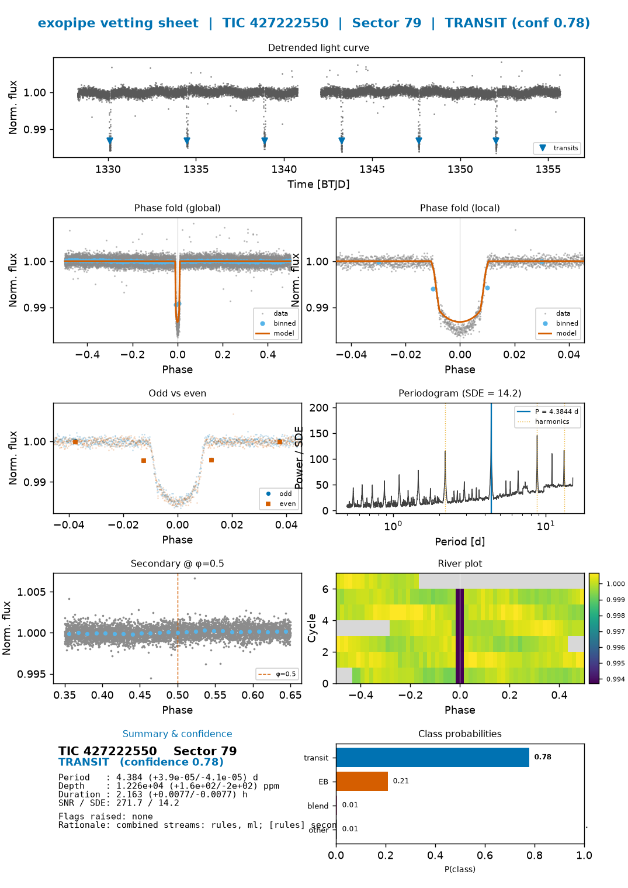

# exopipe

**AI-enabled detection and classification of exoplanet transits in noisy TESS light curves.**
*BAH 2026 — Problem Statement 7.*

`exopipe` ingests a star's brightness time series, **detrends** instrumental and
stellar trends, **searches** for periodic transit-like dips, **vets** them with
physics tests, **classifies** each signal as `transit` / `eclipsing_binary` /
`blend` / `other` with a **calibrated confidence**, reports a detection
**significance** (SNR / SDE), and for genuine transits **fits** the orbital
period, transit depth, and duration **with uncertainties** — all **visualised**
on a one-page vetting sheet and summarised in a ≤3-page report. It runs end to
end on an offline synthetic generator with **core dependencies only** (no
network), and scales to a full TESS sector (~20–30k stars) with optional
parallelism and accelerators.

## What it does (PS7 requirement mapping)

| PS7 requirement | Where it is implemented |
| --- | --- |
| Identify periodic dips in noisy light curves | `exopipe.detrend` (biweight / Savitzky–Golay / sigma-clip) → `exopipe.search` (BLS triage → TLS confirm), `exopipe.significance` |
| Classify dips into transit / eclipse / blend / other | `exopipe.classify` (rules + calibrated ML + optional CNN + physics veto); `exopipe.vetting` (15 physics tests) |
| Apply the classifier to science datasets | `exopipe.pipeline.process_lightcurve`, `exopipe.driver.run_batch`, CLI `exopipe run` / `exopipe demo` |
| Signal-to-noise ratio / significance | `exopipe.significance` (transit SNR, CDPP, bootstrap/GEV FAP, SDE) → `DetectionResult.snr` / `.sde` |
| Estimate transit depth, period, duration | `exopipe.fit.fit_transit` (trapezoid/LM seed → `batman` + `emcee`, 16/50/84 credible intervals, ΔBIC) |
| Visualise the detected & classified signal | `exopipe.viz.vetting_sheet` (one-page multi-panel sheet) |
| Confidence level of the detected signal | calibrated class probabilities (`CalibratedClassifierCV`, isotonic) + parameter uncertainties |
| ≤3-page report (methodology, assumptions, tools, uncertainty) | `exopipe.report.generate_report` (Quarto/pandoc → matplotlib fallback) |

## Install

Core foundation (numpy / scipy / matplotlib / pandas only):

```bash
pip install -e .
# or:  pip install -r requirements-core.txt
```

Optional capability groups (install only what you need):

```bash
pip install -e ".[science]"   # astropy, lightkurve, transitleastsquares, wotan, batman, emcee, dynesty, astroquery
pip install -e ".[ml]"        # scikit-learn, xgboost, lightgbm
pip install -e ".[dl]"        # torch (view-based CNN)
pip install -e ".[perf]"      # numba, joblib, pyarrow, zarr, bottleneck, hnswlib
pip install -e ".[app]"       # streamlit, plotly (dashboard)
pip install -e ".[dev]"       # pytest, ruff
pip install -e ".[all]"       # everything
```

Every heavy/optional dependency is imported **lazily** and degrades gracefully:
the full demo, the classifier (scikit-learn fallback), the vetting sheet, and the
report all work in the pure-core environment.

## Quickstart

```bash
# End-to-end offline demo: synthetic population -> detect/vet/classify/fit ->
# catalog + per-candidate vetting sheets + report.  No network required.
PYTHONPATH=src python -m exopipe.cli demo --n 16 --figures --out runs/demo
```

This writes `runs/demo/catalog.csv`, `runs/demo/vetting_sheets/*.png`, and
`runs/demo/report.*`, and prints a per-class predicted-vs-truth accuracy table.
The demo auto-loads the trained classifier at `models/exopipe_clf.joblib` (when
present) so predictions use **calibrated ML + rules + physics veto**; without a
model it cleanly falls back to the rules + physics-veto floor.

In Python:

```python
import exopipe
from exopipe.data import make_synthetic_lightcurve
from exopipe.classify.ensemble import load_models

lc = make_synthetic_lightcurve("transit", seed=1)
result = exopipe.process_lightcurve(lc, models=load_models("models"))
print(result.classification.label, result.classification.confidence)
print(result.detection.period, result.detection.snr)
```

## Pipeline stages

`exopipe.pipeline.process_lightcurve` runs one light curve through a linear,
independently-cacheable, crash-safe stage sequence (each stage degrades to a
safe empty result on failure, so a 20–30k-star sector run never aborts mid-way):

```
ingest → detrend → search → vet → features → classify → fit → viz/report → catalog
```

- **ingest** (`data/loaders.py`, `data/synthetic.py`) — TESS FITS / CSV / MAST, or the offline synthetic generator.
- **detrend** (`detrend.py`) — biweight (wotan) / Savitzky–Golay (scipy) / sigma-clip (astropy).
- **search** (`search.py`) — BLS triage (astropy / pure-NumPy, optional numba) → TLS confirm (transitleastsquares).
- **vet** (`vetting.py`) — 15 physics tests: odd/even, secondary eclipse, V-shape, centroid, CROWDSAP, implied radius, …
- **features** (`features.py`) — 38 NaN-safe tabular features + phase-folded CNN views.
- **classify** (`classify/`) — rules + calibrated XGBoost/LightGBM/RF (isotonic) + optional CNN, combined and overridden by a decisive **physics veto**.
- **fit** (`fit.py`) — trapezoid/LM seed → `batman` + `emcee`; 16/50/84 credible intervals, ΔBIC. Gated on classification to save the sector budget.
- **viz / report** (`viz.py`, `report.py`) — one-page vetting sheet; ≤3-page methodology+results report.
- **catalog** (`catalog.py`) — flatten each result to one row; write CSV/Parquet.

## CLI commands

```bash
exopipe demo       # offline synthetic run -> catalog + vetting sheets + report
exopipe run        # process a directory of FITS / a CSV -> catalog + figures
exopipe fetch      # download a TESS sector / TIC from MAST (network)
exopipe train      # train + calibrate the classifier (grouped CV)
exopipe report     # render the <=3-page report from a catalog
exopipe dashboard  # launch the Streamlit catalog browser
exopipe version    # package version + optional-dependency status
```

`exopipe --help` and every subcommand's `--help` work with only core deps.

## Outputs & examples

- A run writes `catalog.{csv,parquet}`, `vetting_sheets/*.png`, `report.{pdf,md}`, and an O(1) resume `manifest.json` under its `--out` directory.
- Curated, committed example artifacts live in [`examples/`](examples/): one
  vetting sheet **per class**, the demo catalog, and the ≤3-page report. See
  [`examples/README.md`](examples/README.md) to reproduce them.



## Validation

- **Test suite:** `PYTHONPATH=src python -m pytest -q` → **69 passed** (detection injection–recovery, detrending, vetting, fit recovery, classification, end-to-end pipeline, catalog/viz), core deps only.
- **Detection — injection–recovery:** on detectable injected transits the two-stage BLS→TLS search recovers the period to a **median ≈ 0.1%** relative error (alias-aware).
- **Parameter fitting:** `batman`+`emcee` recovers transit **depth to ≈ 0.2%** and **duration to ≈ 1.7%** median relative error on recovered transits, each reported with asymmetric 16/50/84 credible intervals.
- **Classifier (grouped CV by TIC, 4 classes, calibrated XGBoost):** overall accuracy **0.862** (vs the 0.25 four-class chance baseline) on a detectability-biased synthetic population (n=260), trained on the same real `detect → vet → features` path used at inference. Per-class F1: transit 0.85, eclipsing_binary 0.78, blend 0.99, other 0.87.

  Confusion matrix (rows = true, cols = predicted):

  | true \ pred | transit | EB | blend | other |
  | --- | --- | --- | --- | --- |
  | **transit** | 72 | 9 | 0 | 7 |
  | **eclipsing_binary** | 7 | 47 | 0 | 8 |
  | **blend** | 1 | 0 | 41 | 0 |
  | **other** | 1 | 3 | 0 | 64 |

- **End-to-end demo (`demo --n 16`):** wiring the trained classifier into the
  pipeline lifts per-class predicted-vs-truth accuracy from **43.8%** (rules +
  veto only) to **68.8%** — the rules-only path systematically over-calls
  eclipsing binaries and never recovers `transit`/`other`, which the calibrated
  ML corrects.

## Methods & data

`exopipe` is backed by a catalog of **72 candidate methods** (M1–M72: detrending,
period search, significance, vetting, classification, fitting, visualisation —
each with a library call and a pure-Python fallback) and a **multi-mission data
layer** (TESS primary signal; Kepler/K2 for labelled augmentation; Gaia DR3 +
TIC v8.2 for blend/contamination context; NASA Exoplanet Archive / ExoFOP /
TESS-EB / Kepler-EB catalogs for ground-truth labels). See
[`ARCHITECTURE.md`](ARCHITECTURE.md) and the research dossiers under
[`research/`](research/) for the full design.

## Conventions (for contributors)

- **Time** is in days (`float64`); **flux**/**flux_err** are normalised to a median of ~1.0.
- **Depths** are fractional (`0.01` = 1% = 10 000 ppm), positive for a dip; **periods** and **durations** are in days.
- Build `LightCurve` objects via `exopipe.data.from_arrays(...)` so dtypes and normalisation stay consistent.
- Every pipeline stage exchanges data through the dataclasses in `exopipe.types`; `CandidateResult.to_row()` flattens a result into one catalog row.

## License

MIT.
